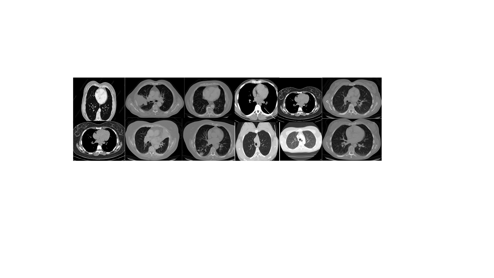
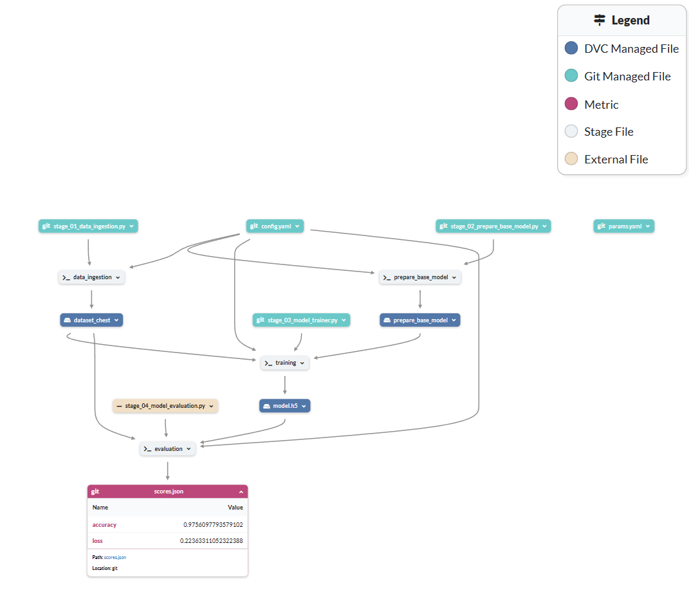
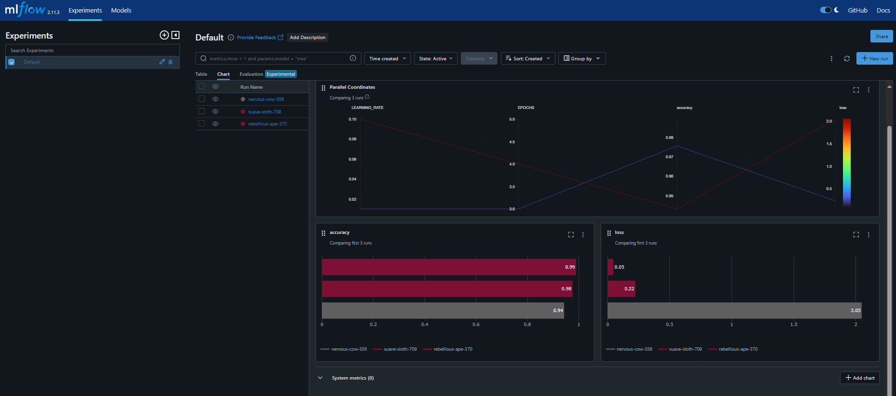
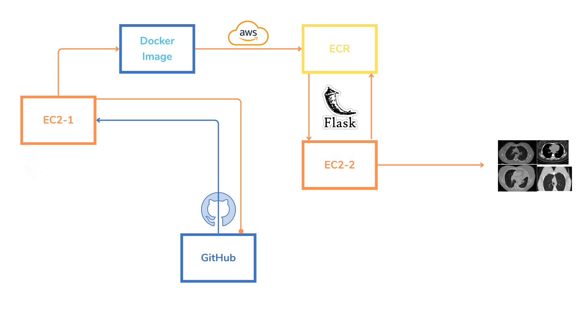
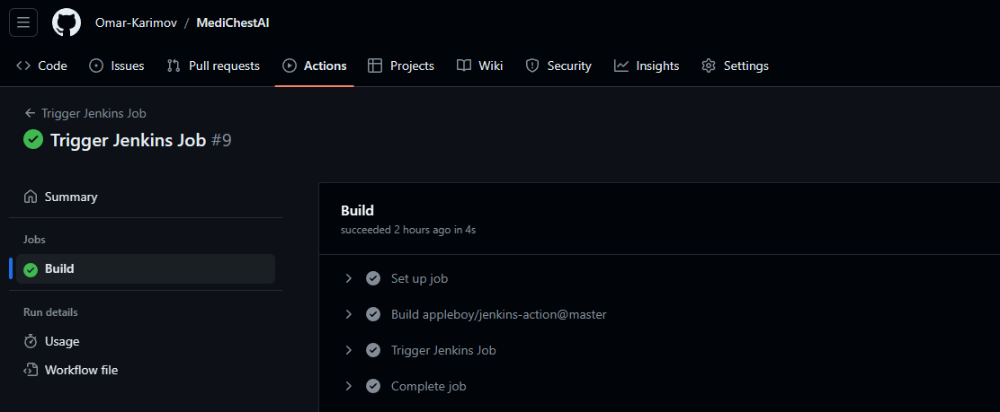
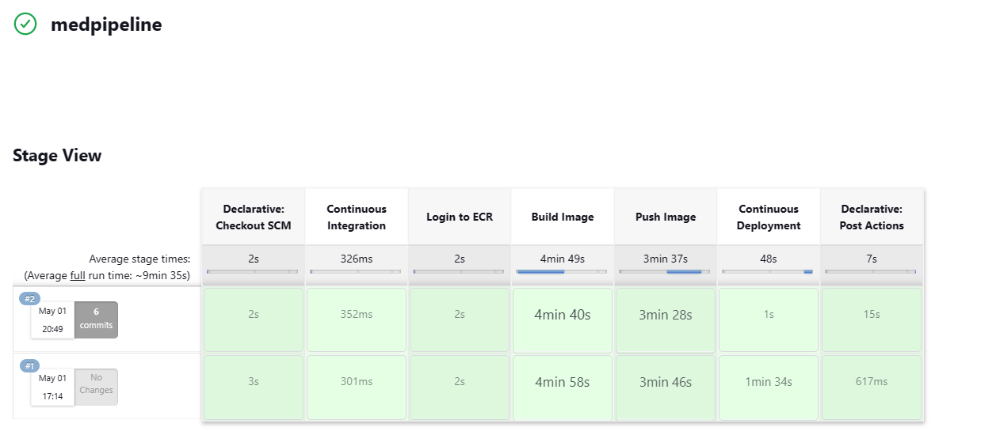
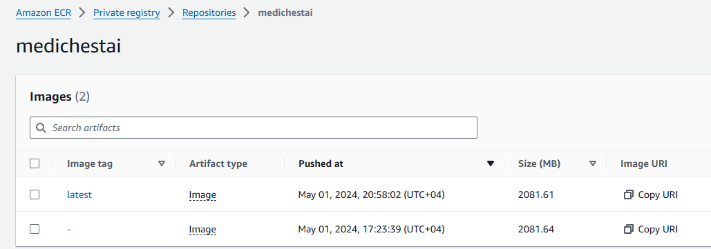
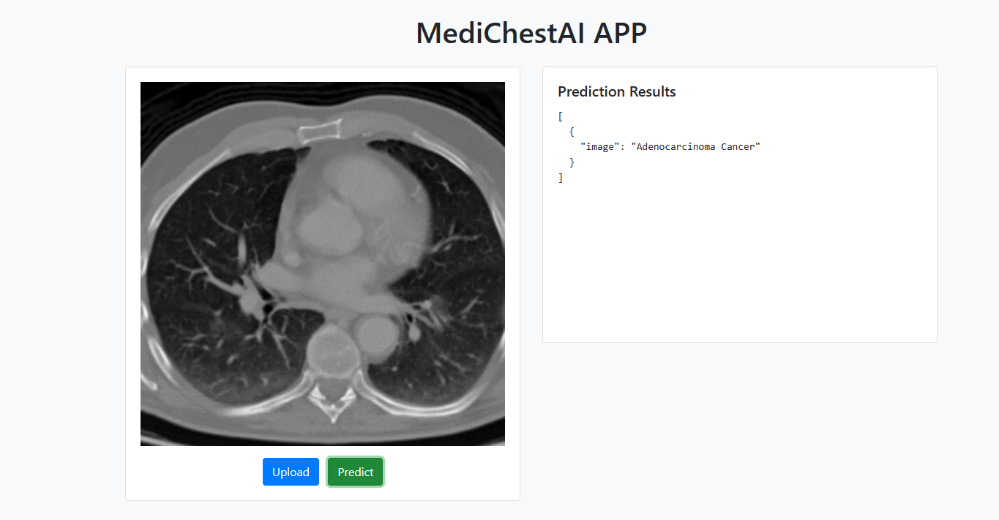

# MediChestAI

MediChestAI is a comprehensive MLOps project focused on classifying chest CT images as normal or adenocarcinoma using deep learning model. The project integrates various modern tools and practices to streamline the process of development, testing, deployment, and maintenance.




## Table of Contents
- [Project Overview](#project-overview)
- [Project Structure](#project-structure)
- [Dataset](#dataset)
- [Data Pipeline](#data-pipeline)
- [MLflow Experiments](#mlflow-experiments)
- [CI/CD Deployment](#cicd-deployment)
- [Installation](#installation)
- [Usage](#usage)
- [MLflow DagsHub Connection](#mlflow-dagshub-connection)
- [DVC Commands](#dvc-commands)


# Project Overview

* MLOps Workflow: Implements an end-to-end CI/CD pipeline using Jenkins for continuous integration and deployment, triggered by GitHub Actions. GitHub Actions orchestrates the process by triggering the Jenkins job that builds, tests, and deploys the project.

* Deployment: The application is designed to be deployed on AWS EC2 instances, leveraging Docker containers stored in Amazon ECR for consistent and scalable deployment.
 - Docker: A Dockerfile is included to build the project's Docker image, which is based on the python:3.8-slim-buster image. The Dockerfile installs the required dependencies and starts the Flask application.
 - Docker Compose: The project includes a docker-compose.yaml file for running the application using Docker Compose. It maps port 8080 on the host to port 8080 on the container.

* Pipeline Tracking (DVC): DVC is used to manage and track the project's machine learning pipeline, including stages like data ingestion, model preparation, training, and evaluation.

* MLflow Integration: For experiment tracking and serving, MLflow is integrated into the project, with DAGsHub providing a centralized URI for managing and tracking experiments.

* Data Storage: The project's data is stored on Google Drive, ensuring easy access and version control through DVC.

* Flask Application: A Flask web application with a user-friendly interface is developed for interacting with the model, allowing users to easily upload CT images and get predictions.

* Python Modular Approach: The project emphasizes a modular Python approach, following industry best practices to ensure maintainability and scalability.

* Model Framework: TensorFlow and Keras frameworks are used for developing the deep learning model, specifically using the VGG16 architecture.


# Project Structure

```bash
MediChestAI/
│
├── .dvc/                    # DVC cache and temporary files
│   ├── cache/
│   └── tmp/
│
├── .github/
│   └── workflows/
│       └── main.yaml        # GitHub Actions workflow for triggering Jenkins
│
├── jenkins/
│   └── Jenkinsfile          # Jenkins pipeline configuration
│
├── artifacts/               # Folder to store pipeline outputs
│
├── config/                  # Configuration files for the project
│   └── config.yaml          # Project configuration
│
├── logs/
│   └── running_logs.log     # Application logs
│
├── model/
│   └── model.h5             # Saved model
│
├── research/                # Jupyter notebooks
│   ├── 01_data_ingestion.ipynb
│   ├── 02_prepare_base_model.ipynb
│   ├── 03_model_trainer.ipynb
│   └── 04_model_evaluation_with_mlflow.ipynb
│
├── scripts/
│   ├── ec2_setup.sh         # Shell script to setup EC2 instance
│   └── jenkins.sh           # Jenkins setup script
│
├── src/                     # Source code for the project
│   └── CNNClassifier/
│       ├── __init__.py      # Init file for the package
│       ├── components/      # Pipeline components
│       │   ├── data_ingestion.py
│       │   ├── model_evaluation.py
│       │   ├── model_trainer.py
│       │   ├── prepare_base_model.py
│       │   └── __init__.py
│       │
│       ├── config/          # Configuration-related source code
│       │   ├── configuration.py
│       │   └── __init__.py
│       │
│       ├── constants/       # Project constants
│       │   ├── __init__.py
│       │
│       ├── entity/          # Entity classes
│       │   ├── config_entity.py
│       │   └── __init__.py
│       │
│       ├── pipeline/        # Pipeline scripts
│       │   ├── stage_01_data_ingestion.py
│       │   ├── stage_02_prepare_base_model.py
│       │   ├── stage_03_model_trainer.py
│       │   ├── stage_04_model_evaluation.py
│       │   └── __init__.py
│       │
│       ├── utils/           # Utility functions
│       │   ├── common.py
│       │   └── __init__.py
│
├── templates/
│   └── index.html           # HTML template for the Flask web app
│
├── .dockerignore            # Files to exclude from Docker builds
├── .dvcignore               # Files to exclude from DVC
├── .gitignore               # Files to exclude from Git
├── app.py                   # Flask application entry point
├── docker-compose.yaml      # Docker Compose configuration file
├── Dockerfile               # Dockerfile for building the Docker image
├── dvc.lock                 # DVC lock file
├── dvc.yaml                 # DVC pipeline configuration
├── inputImage.jpg           # Sample input image
├── LICENSE                  # Project license
├── main.py                  # Main Python script with the model pipeline stages
├── params.yaml              # Parameters for training VGG16 model
├── README.md                # Project README
├── requirements.txt         # Python dependencies
├── scores.json              # Model evaluation scores
├── setup.py                 # Setup script for the Python package
└── template.py              # Template script for setting up project structure
```

# Dataset

The dataset used for training and evaluation can be found on Google Drive. You can download it using the link below:

[CT Image Dataset](https://drive.google.com/file/d/1LYZ0eHigFs8tjD9P9eDpBuoWcPH4urbu/view?usp=sharing)


# Data Pipeline

The data pipeline of the MediChestAI project includes several key stages, each of which has a specific role in the machine learning workflow:




1. **Data Ingestion**: 
    - The `stage_01_data_ingestion.py` file is responsible for downloading and extracting data from a given URL. The dataset is downloaded as a zip file, then extracted to the specified location for further processing.

2. **Prepare Base Model**:
    - The `stage_02_prepare_base_model.py` file prepares a base model using VGG16 architecture.
    - It initializes the model with specific configurations such as input image size, weights ("imagenet"), and whether to include the top layer.
    - This stage saves the initialized model for further use in training and evaluation.

3. **Training**:
    - The `stage_03_model_trainer.py` file handles the training of the initialized model using the training dataset.
    - The model is fine-tuned with key hyperparameters like learning rate, batch size, and epochs, as specified in the `params.yaml` file.
    - After training, the model is saved for evaluation.

4. **Evaluation**:
    - The `stage_04_model_evaluation.py` file evaluates the trained model's performance using a validation dataset.
    - It computes evaluation metrics like accuracy and loss, which are saved in a JSON file for analysis.

The pipeline is managed with DVC to ensure reproducibility and version control, making it easy to track changes and improve the pipeline iteratively.


# MLflow Experiments

The project leverages MLflow to track and visualize experiments, allowing you to monitor different metrics such as accuracy and loss over multiple training runs. This helps in understanding the model's performance across different hyperparameter settings.

#### Key Features:
- **Tracking Experiments**: Track experiments and compare their metrics and parameters side by side.
- **UI Visualization**: The MLflow UI provides a clear visualization of the experiments to evaluate model performance.
- **Integration with DagsHub**: Easily integrates with DagsHub for centralized experiment tracking.

To see the experiment tracking in action, here's a screenshot from the MLflow UI:




# CI/CD Deployment



The CI/CD deployment architecture for MediChestAI includes the following components:

1. **GitHub Actions**:
   - Used to trigger Jenkins jobs upon pushing changes to the main repository on GitHub.
   - Acts as the starting point in the CI/CD pipeline.
   - 

2. **Jenkins (EC2-1)**:
   - Jenkins is installed on an EC2 instance (EC2-1) and is responsible for managing the CI/CD pipeline.
   - It orchestrates the build, testing, and deployment processes.
   - Jenkins fetches the code from GitHub, builds the Docker image, and pushes it to Amazon ECR.
   - 

3. **Amazon ECR (Elastic Container Registry)**:
   - Stores the Docker images built by Jenkins.
   - Acts as a centralized repository for the project's Docker images, ensuring that they are versioned and securely stored.
   - 

4. **EC2-2 (Flask Application)**:
   - A second EC2 instance (EC2-2) is used to host the Flask application.
   - The Flask application is deployed using the Docker image pulled from ECR.
   - This instance acts as an endpoint that serves predictions based on the input data.

### Deployment Workflow

1. **Source Code Commit**: Changes to the code are pushed to the GitHub repository.
   
2. **Triggering Jenkins**: GitHub Actions triggers a Jenkins job to handle the CI/CD pipeline.

3. **Building the Docker Image**: Jenkins builds the Docker image based on the Dockerfile in the repository.

4. **Pushing to ECR**: The Docker image is pushed to Amazon ECR.

5. **Deployment on EC2-2**: The Flask application running on EC2-2 pulls the latest Docker image from ECR and deploys it, making the new version of the application available for use.

This setup ensures automated, consistent, and reliable deployment of the project, enabling continuous integration and delivery.


# Installation

1. Clone the repository:

```bash
https://github.com/Omar-Karimov/MediChestAI.git
```

2. Create and activate a virtual environment:

```bash
conda create -n medichest python=3.8 -y
conda activate medichest
```

3. Install the required Python dependencies:

```bash
pip install -r requirements.txt
```

4. Set up the package for development:

```bash
pip install -e .
```


# Usage

1. To run the application:


```bash
python app.py
```

2. Access the application in your web browser at http://localhost:8080.




# MLflow DagsHub Connection

To set up MLflow tracking using DagsHub:

1. **Create a DagsHub Account**:
   - Visit [DagsHub](https://dagshub.com/) and create a free account.

2. **Connect Your GitHub Repository to DagsHub**:
   - In DagsHub, create a new project and link it to your existing GitHub repository.
   - Enable the **Experiments** feature for your project.

3. **Get MLflow Tracking Credentials**:
   - After connecting your GitHub repo, click on the **Remote** tab in DagsHub.
   - Copy the following environment variables provided by DagsHub:
     ```
     MLFLOW_TRACKING_URI=https://dagshub.com/<your-username>/<your-repo>.mlflow
     MLFLOW_TRACKING_USERNAME=<your-username>
     MLFLOW_TRACKING_PASSWORD=<your-password>
     ```

4. **Set the Environment Variables**:
   - You can either export these variables using Git Bash:
     ```bash
     export MLFLOW_TRACKING_URI=https://dagshub.com/<your-username>/<your-repo>.mlflow
     export MLFLOW_TRACKING_USERNAME=<your-username>
     export MLFLOW_TRACKING_PASSWORD=<your-password>
     ```
   - Alternatively, you can add these to your system environment variables.

5. **Access the MLflow UI**:
   - Go to the **MLflow UI** tab in DagsHub to track all experiments linked to your project.


# DVC Commands

* Initialize DVC:

```bash
dvc init
```

* Reproduce the pipeline:

```bash
dvc repro
```

- DVC will automatically skip stages that haven't changed and run only the necessary parts of the pipeline.

* Visualize the pipeline:

```bash
dvc dag
```

- This will generate a graph illustrating the flow of the data pipeline.

```bash
+----------------+            +--------------------+ 
| data_ingestion |            | prepare_base_model | 
+----------------+*****       +--------------------+ 
         *             *****             *
         *                  ******       *
         *                        ***    *
         **                        +----------+      
           **                      | training |      
             ***                   +----------+      
                ***             ***
                   **         **
                     **     **
                  +------------+
                  | evaluation |
                  +------------+
```

